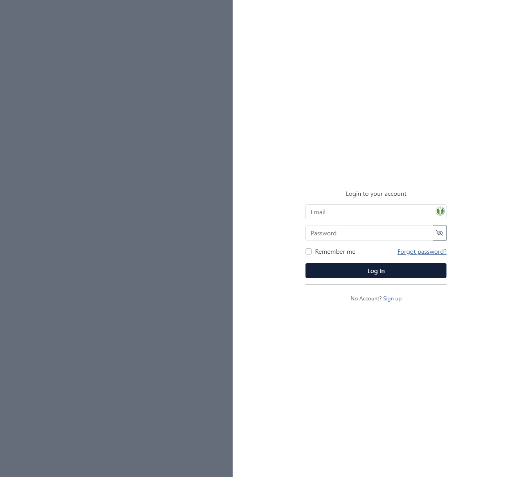

# React based authentication page template

This is my starter template for Login, Register and Forgot Password using ReactJS with simple form validation. Upon entering your credentials, the app will display a simple alert if you are logged in.
Based on React v17.

## Screenshot


## Installation
Clone this repository
```bash
git clone https://github.com/christerjohansson/react-authentication-page-template.git
```

go to react-auth-template directory.

In the project directory, you can run:

### `npm install`
This will install all the dependencies of the app.

### `npm start`

Open your browser and go to [http://localhost:3000](http://localhost:3000).

The page will reload if you make any changes on the code

### `npm run build`

This will build the app for production.


## Screenshots


#### Login Form w/ invalid email validation
#### *NOTE: to show this email error message, change the input type from "email" to "text"*


#### Register Form


#### Forgot Password Form


